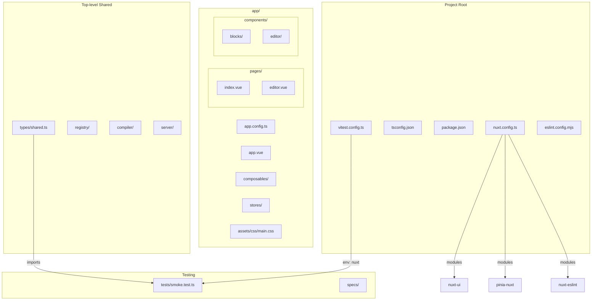
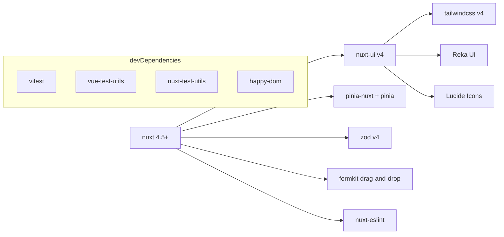

# Design Document: 01-project-setup

## Overview

This design describes the scaffolding of a Nuxt 4 visual page builder foundation. The scaffold produces a fully configured, verified skeleton that all subsequent builder tasks depend on. It initializes the framework, installs dependencies, creates the directory structure, defines base shared types, configures tooling, and provides placeholder pages with a smoke test.

The scaffold is a one-time setup operation. It does not implement any builder features — only the clean foundation with correct configuration, shared type definitions, and development tooling.

### Key Design Decisions

1. **Nuxt 4 `app/` directory convention** — All application code lives under `app/` per Nuxt 4 defaults. Framework-agnostic code (types, registry, compiler) is top-level.
2. **TypeScript strict with no `any`** — Enforced via `nuxt.config.ts` and `tsconfig.json` settings.
3. **Nuxt UI v4 theming via `app.config.ts`** — Runtime color configuration using `ui.colors` key with semantic color aliases.
4. **Branded types for NodeId** — Compile-time safety using TypeScript intersection branding pattern.
5. **Vitest with Nuxt environment** — Uses `@nuxt/test-utils/config` so component tests get Nuxt context automatically.

## Architecture



### Dependency Graph



## Components and Interfaces

### Configuration Files

#### `nuxt.config.ts`

```typescript
export default defineNuxtConfig({
  modules: [
    '@nuxt/ui',
    '@pinia/nuxt',
    '@nuxt/eslint'
  ],

  ssr: true,

  typescript: {
    strict: true,
    typeCheck: true
  },

  css: ['~/assets/css/main.css']
})
```

#### `app/app.config.ts`

```typescript
export default defineAppConfig({
  ui: {
    colors: {
      primary: 'indigo',
      neutral: 'slate'
    }
  }
})
```

#### `app/assets/css/main.css`

```css
@import "tailwindcss";
@import "@nuxt/ui";
```

#### `vitest.config.ts`

```typescript
import { defineVitestConfig } from '@nuxt/test-utils/config'

export default defineVitestConfig({
  test: {
    environment: 'nuxt'
  }
})
```

#### `eslint.config.mjs`

```javascript
import nuxt from './.nuxt/eslint.config.mjs'

export default nuxt()
```

#### `app/app.vue`

```vue
<template>
  <UApp>
    <NuxtPage />
  </UApp>
</template>
```

### Package Scripts

```json
{
  "scripts": {
    "dev": "nuxi dev",
    "build": "nuxi build",
    "generate": "nuxi generate",
    "lint": "eslint .",
    "lint:fix": "eslint . --fix",
    "typecheck": "nuxt typecheck",
    "test": "vitest run",
    "test:watch": "vitest"
  }
}
```

### Pages

#### `app/pages/index.vue`

```vue
<template>
  <div class="flex items-center justify-center min-h-screen">
    <UButton to="/editor" size="lg">
      Open Editor
    </UButton>
  </div>
</template>
```

#### `app/pages/editor.vue`

```vue
<template>
  <div class="flex items-center justify-center min-h-screen">
    <p class="text-lg text-neutral-500">Editor coming soon</p>
  </div>
</template>
```

## Data Models

### `types/shared.ts` — Base Shared Types

```typescript
// ─── PropType ────────────────────────────────────────────────────────────────

/**
 * The kinds of properties a component can expose to the editor.
 */
export type PropType =
  | 'string'
  | 'text'
  | 'number'
  | 'boolean'
  | 'enum'
  | 'color'
  | 'url'
  | 'image'

// ─── PropSchema ──────────────────────────────────────────────────────────────

/**
 * Base fields shared by all prop schema variants.
 */
interface PropSchemaBase {
  label?: string
}

interface StringPropSchema extends PropSchemaBase {
  type: 'string'
  default?: string
}

interface TextPropSchema extends PropSchemaBase {
  type: 'text'
  default?: string
}

interface NumberPropSchema extends PropSchemaBase {
  type: 'number'
  default?: number
  min?: number
  max?: number
  step?: number
}

interface BooleanPropSchema extends PropSchemaBase {
  type: 'boolean'
  default?: boolean
}

interface EnumPropSchema extends PropSchemaBase {
  type: 'enum'
  default?: string
  options: [string, ...string[]] // at least 1 element
}

interface ColorPropSchema extends PropSchemaBase {
  type: 'color'
  default?: string
}

interface UrlPropSchema extends PropSchemaBase {
  type: 'url'
  default?: string
}

interface ImagePropSchema extends PropSchemaBase {
  type: 'image'
  default?: string
}

/**
 * Discriminated union of all property schema variants, keyed on `type`.
 */
export type PropSchema =
  | StringPropSchema
  | TextPropSchema
  | NumberPropSchema
  | BooleanPropSchema
  | EnumPropSchema
  | ColorPropSchema
  | UrlPropSchema
  | ImagePropSchema

// ─── NodeId ──────────────────────────────────────────────────────────────────

declare const __nodeIdBrand: unique symbol

/**
 * A branded string type wrapping a UUID. Cannot be assigned from a plain
 * string without an explicit cast — provides compile-time safety.
 */
export type NodeId = string & { readonly [__nodeIdBrand]: typeof __nodeIdBrand }

/**
 * Creates a new NodeId using crypto.randomUUID().
 */
export function makeNodeId(): NodeId {
  return crypto.randomUUID() as NodeId
}
```

### Directory Skeleton

All directories that are empty after creation receive a `.gitkeep` file:

```
project-root/
├── app/
│   ├── assets/
│   │   └── css/
│   │       └── main.css
│   ├── components/
│   │   ├── blocks/
│   │   │   └── .gitkeep
│   │   └── editor/
│   │       └── .gitkeep
│   ├── composables/
│   │   └── .gitkeep
│   ├── stores/
│   │   └── .gitkeep
│   ├── pages/
│   │   ├── index.vue
│   │   └── editor.vue
│   ├── app.config.ts
│   └── app.vue
├── types/
│   └── shared.ts
├── registry/
│   └── .gitkeep
├── compiler/
│   └── .gitkeep
├── tests/
│   └── smoke.test.ts
├── specs/
│   └── .gitkeep
├── server/
│   └── .gitkeep
├── nuxt.config.ts
├── tsconfig.json
├── vitest.config.ts
├── eslint.config.mjs
├── package.json
└── package-lock.json
```

## Correctness Properties

*A property is a characteristic or behavior that should hold true across all valid executions of a system — essentially, a formal statement about what the system should do. Properties serve as the bridge between human-readable specifications and machine-verifiable correctness guarantees.*

### Property 1: makeNodeId format validity

*For any* invocation of `makeNodeId()`, the returned value SHALL be a string matching the UUID v4 format: 36 characters long with pattern `xxxxxxxx-xxxx-4xxx-yxxx-xxxxxxxxxxxx` where `y` is one of `[8, 9, a, b]`.

**Validates: Requirements 4.4, 7.3**

### Property 2: makeNodeId uniqueness

*For any* two distinct invocations of `makeNodeId()`, the returned values SHALL be different strings.

**Validates: Requirements 4.4, 7.4**

## Error Handling

This is a scaffold/setup task. Error handling is minimal and focused on:

1. **Dependency resolution failures** — If `npm install` encounters unresolved peer dependencies, the scaffold is considered failed. Resolution: verify version constraints are compatible before committing `package.json`.

2. **Directory creation failures** — If a filesystem error prevents directory creation (permissions, disk full), the scaffold should report which directory failed and halt. This is inherent to the file creation tooling, not custom code.

3. **TypeScript compilation errors** — If `nuxt typecheck` fails, the scaffold is incomplete. The type definitions in `types/shared.ts` must compile under `strict: true`.

4. **Build failures** — If `nuxi build` fails, the configuration is incorrect. The scaffold verifies this via the integration test step.

No runtime error handling code is needed for this task — the scaffold produces static files that are verified by build/lint/test tooling.

## Testing Strategy

### Approach

This feature is primarily configuration and scaffolding. The testing strategy uses:

- **Smoke tests** for verifying the pipeline works end-to-end
- **Property-based tests** for the one piece of runtime logic (`makeNodeId`)
- **Integration tests** (build/typecheck/lint commands) to verify the scaffold is correct

### Property-Based Testing

**Library**: Vitest with `fast-check` (or Vitest's built-in property testing support is not available — use `fast-check` as the PBT library).

**Configuration**: Minimum 100 iterations per property test.

**Tag format**: `Feature: 01-project-setup, Property {number}: {property_text}`

#### Property Tests

| Property | Test Description | Iterations |
|----------|-----------------|------------|
| Property 1: makeNodeId format validity | Generate 100+ calls to `makeNodeId()`, assert each matches UUID v4 regex | 100 |
| Property 2: makeNodeId uniqueness | Generate 100+ calls to `makeNodeId()`, collect in a Set, assert Set size equals call count | 100 |

### Unit Tests (Example-Based)

| Test | What it verifies |
|------|-----------------|
| `smoke.test.ts` | `makeNodeId()` returns UUID v4 format, two calls return different values |
| Type compilation | `types/shared.ts` compiles without errors (verified by `typecheck` script) |

### Integration Tests (Manual Verification)

| Command | What it verifies |
|---------|-----------------|
| `npm run typecheck` | All TypeScript compiles under strict mode |
| `npm run lint` | ESLint passes with no violations |
| `npm run test` | Smoke test passes |
| `npm run build` | Full Nuxt build succeeds |
| `npm run dev` + navigate | Pages render, Nuxt UI button works, theme applies |

### Test File Locations

- `/tests/smoke.test.ts` — Smoke test proving Vitest works and can import project types
- `/tests/makeNodeId.property.test.ts` — Property-based tests for `makeNodeId()`
