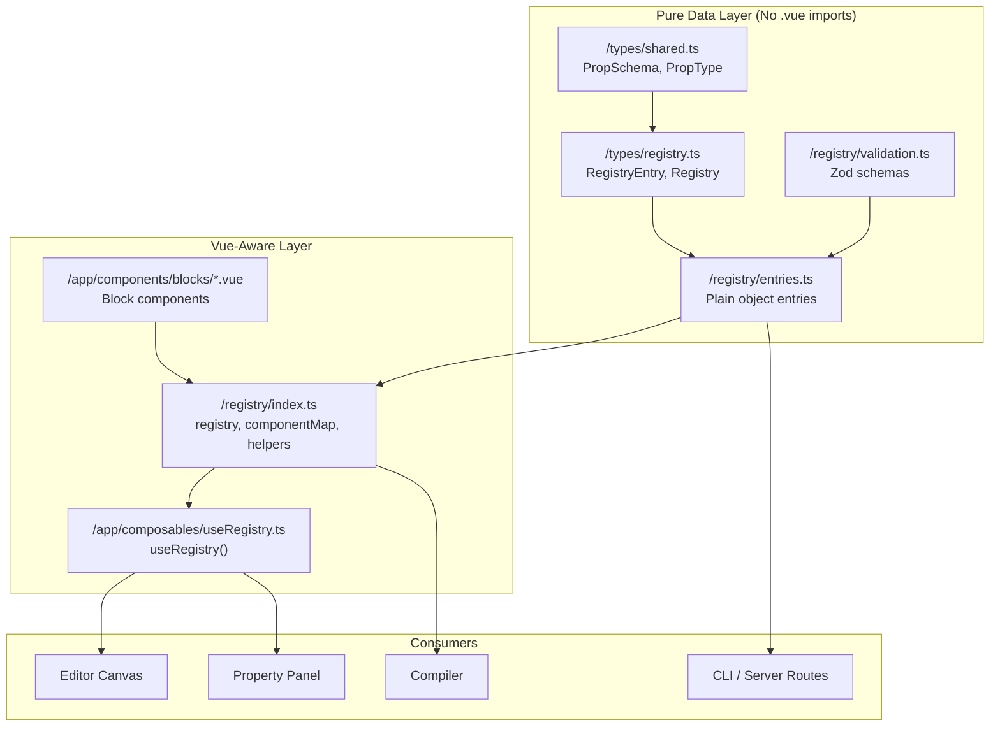
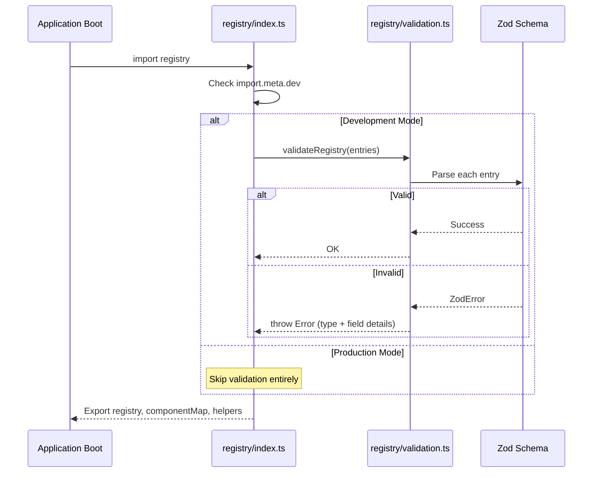

# Design Document: Component Registry

## Overview

The Component Registry is the central metadata store for all placeable building blocks in the Nuxt Visual Builder. It provides a typed, validated, single-source-of-truth that the render engine, property panel, and compiler all consume without hardcoding component knowledge.

The registry architecture follows a **purity split** pattern: a pure-data module (`/registry/entries.ts`) contains all metadata as plain serializable objects — importable from Node.js, CLI tools, or server routes — while a Vue-aware module (`/registry/index.ts`) marries that metadata with actual `.vue` component references for runtime rendering.

Key design decisions:
- **Nuxt UI as primary block set**: The builder wraps Nuxt UI page-building components (`UPageHero`, `UPageSection`, etc.) as first-class blocks, ensuring WYSIWYG fidelity between editor and production.
- **Custom gap-fillers for gaps**: `RichText`, `Image`, and `Spacer` cover functionality Nuxt UI doesn't provide.
- **Zod validation in dev only**: Registry entries are schema-validated at module load time during development, but validation is tree-shaken in production for zero overhead.
- **Composable access pattern**: A `useRegistry()` composable re-exports registry data for convenient access in Vue components.

## Architecture



### Purity Split Rationale

The split into `entries.ts` (pure) and `index.ts` (Vue-aware) serves two purposes:

1. **Tooling compatibility**: The compiler, CLI scripts, and server routes need registry metadata but run in plain Node.js without Vite's `.vue` file resolution. They import directly from `entries.ts`.
2. **Testability**: The pure-data layer can be tested without a Vue/Nuxt environment, enabling faster unit tests and property-based testing.

### Dev-Time Validation Flow



## Components and Interfaces

### Type Definitions (`/types/registry.ts`)

```typescript
import type { PropSchema } from './shared'

export type Category = 'layout' | 'content' | 'media' | 'form'

export interface RegistryEntry {
  type: string            // PascalCase, matches /^[A-Z][a-zA-Z0-9]*$/, max 50 chars
  label: string           // Human-readable name, max 50 chars
  category: Category
  icon?: string           // Lucide icon name for palette display
  props: Record<string, PropSchema>
  slots?: string[]        // Max 20 elements
  acceptsChildren: boolean
  allowedChildren?: string[]  // Max 50 elements; only valid if acceptsChildren is true
  allowedParents?: string[]   // Max 50 elements
  compileAs?: string      // Nuxt UI tag name (e.g., 'UPageHero')
}

export type Registry = Record<string, RegistryEntry>
```

### Validation Module (`/registry/validation.ts`)

```typescript
import { z } from 'zod'

// Zod schema for PropSchema validation
export const propSchemaZod: z.ZodType = z.discriminatedUnion('type', [
  z.object({ type: z.literal('string'), label: z.string().optional(), default: z.string().optional() }),
  z.object({ type: z.literal('text'), label: z.string().optional(), default: z.string().optional() }),
  z.object({ type: z.literal('number'), label: z.string().optional(), default: z.number().optional(), min: z.number().optional(), max: z.number().optional(), step: z.number().optional() }),
  z.object({ type: z.literal('boolean'), label: z.string().optional(), default: z.boolean().optional() }),
  z.object({ type: z.literal('enum'), label: z.string().optional(), default: z.string().optional(), options: z.array(z.string()).min(1) }),
  z.object({ type: z.literal('color'), label: z.string().optional(), default: z.string().optional() }),
  z.object({ type: z.literal('url'), label: z.string().optional(), default: z.string().optional() }),
  z.object({ type: z.literal('image'), label: z.string().optional(), default: z.string().optional() }),
])

// Zod schema for RegistryEntry validation
export const registryEntryZod = z.object({
  type: z.string().min(1).max(50).regex(/^[A-Z][a-zA-Z0-9]*$/),
  label: z.string().min(1).max(50),
  category: z.enum(['layout', 'content', 'media', 'form']),
  icon: z.string().optional(),
  props: z.record(z.string(), propSchemaZod),
  slots: z.array(z.string()).max(20).optional(),
  acceptsChildren: z.boolean(),
  allowedChildren: z.array(z.string()).max(50).optional(),
  allowedParents: z.array(z.string()).max(50).optional(),
  compileAs: z.string().optional(),
}).superRefine((entry, ctx) => {
  // Constraint: allowedChildren requires acceptsChildren: true
  if (!entry.acceptsChildren && entry.allowedChildren !== undefined) {
    ctx.addIssue({
      code: z.ZodIssueCode.custom,
      message: `[${entry.type}] allowedChildren requires acceptsChildren to be true`,
    })
  }
  // Constraint: acceptsChildren:false conflicts with "default" slot
  if (!entry.acceptsChildren && entry.slots?.includes('default')) {
    ctx.addIssue({
      code: z.ZodIssueCode.custom,
      message: `[${entry.type}] acceptsChildren:false conflicts with declaring a "default" slot`,
    })
  }
})

export function validateRegistry(registry: Record<string, unknown>): void {
  for (const [key, entry] of Object.entries(registry)) {
    const result = registryEntryZod.safeParse(entry)
    if (!result.success) {
      const issues = result.error.issues.map(i => i.message).join('; ')
      throw new Error(`Registry validation failed for "${key}": ${issues}`)
    }
    // Verify type field matches key
    if ((entry as { type?: string }).type !== key) {
      throw new Error(`Registry key "${key}" does not match entry.type "${(entry as { type?: string }).type}"`)
    }
  }
}
```

### Entries Module (`/registry/entries.ts`)

Pure-data module exporting all registry entries. Zero `.vue` imports. Example structure:

```typescript
import type { Registry } from '../types/registry'

export const entries: Registry = {
  PageHero: {
    type: 'PageHero',
    label: 'Page Hero',
    category: 'layout',
    icon: 'i-lucide-layout-template',
    props: {
      title: { type: 'string', default: 'Your Page Title' },
      description: { type: 'text', default: 'A compelling description for your hero section' },
      headline: { type: 'string', default: '' },
      orientation: { type: 'enum', options: ['vertical', 'horizontal'], default: 'vertical' },
    },
    acceptsChildren: false,
    compileAs: 'UPageHero',
  },
  // ... all other entries
}
```

### Registry Module (`/registry/index.ts`)

Vue-aware module that combines entries with component imports:

```typescript
import type { Component } from 'vue'
import type { RegistryEntry, Registry } from '../types/registry'
import { entries } from './entries'
import { validateRegistry } from './validation'

// Dev-time validation
if (import.meta.dev) {
  validateRegistry(entries)
}

// Import block components
import BlockPageHero from '~/components/blocks/BlockPageHero.vue'
// ... all other component imports

export const registry: Registry = entries

export const componentMap: Record<string, Component> = {
  PageHero: BlockPageHero,
  // ... all other mappings
}

export function getEntry(type: string): RegistryEntry | undefined {
  return registry[type]
}

export function defaultPropsFor(type: string): Record<string, unknown> | undefined {
  const entry = registry[type]
  if (!entry) return undefined
  const defaults: Record<string, unknown> = {}
  for (const [key, schema] of Object.entries(entry.props)) {
    defaults[key] = schema.default ?? undefined
  }
  return defaults
}

export function entriesByCategory(): Record<string, RegistryEntry[]> {
  const grouped: Record<string, RegistryEntry[]> = {}
  for (const entry of Object.values(registry)) {
    if (!grouped[entry.category]) grouped[entry.category] = []
    grouped[entry.category].push(entry)
  }
  return grouped
}
```

### useRegistry Composable (`/app/composables/useRegistry.ts`)

```typescript
import { registry, componentMap, getEntry, defaultPropsFor, entriesByCategory } from '../../registry'

export function useRegistry() {
  return {
    registry,
    componentMap,
    getEntry,
    defaultPropsFor,
    entriesByCategory,
  }
}
```

### Block Components (`/app/components/blocks/`)

**Nuxt UI Blocks** are thin pass-through wrappers:

```vue
<!-- BlockPageHero.vue -->
<template>
  <UPageHero
    :title="title"
    :description="description"
    :headline="headline"
    :orientation="orientation"
  />
</template>

<script setup lang="ts">
withDefaults(defineProps<{
  title?: string
  description?: string
  headline?: string
  orientation?: 'vertical' | 'horizontal'
}>(), {
  title: 'Your Page Title',
  description: 'A compelling description for your hero section',
  headline: '',
  orientation: 'vertical',
})
</script>
```

**Custom Blocks** implement their own rendering:

```vue
<!-- BlockRichText.vue -->
<template>
  <div :class="['prose max-w-none', alignClass]" v-html="body" />
</template>

<script setup lang="ts">
import { computed } from 'vue'

const props = withDefaults(defineProps<{
  body?: string
  align?: 'left' | 'center' | 'right'
}>(), {
  body: 'Enter your content here.',
  align: 'left',
})

const alignClass = computed(() => ({
  left: 'text-left',
  center: 'text-center',
  right: 'text-right',
}[props.align]))
</script>
```

## Data Models

### RegistryEntry Field Constraints

| Field | Type | Constraints |
|-------|------|-------------|
| `type` | `string` | PascalCase (`/^[A-Z][a-zA-Z0-9]*$/`), max 50 chars, must equal its registry key |
| `label` | `string` | Non-empty, max 50 chars |
| `category` | `Category` | One of: `'layout'`, `'content'`, `'media'`, `'form'` |
| `icon` | `string?` | Optional Lucide icon class |
| `props` | `Record<string, PropSchema>` | Each value is a valid PropSchema discriminated union |
| `slots` | `string[]?` | Optional, max 20 elements |
| `acceptsChildren` | `boolean` | Required |
| `allowedChildren` | `string[]?` | Only valid when `acceptsChildren: true`, max 50 elements |
| `allowedParents` | `string[]?` | Optional, max 50 elements |
| `compileAs` | `string?` | Nuxt UI tag name (e.g., `'UPageHero'`), starts with `'U'` for Nuxt UI blocks |

### PropSchema Variants

| Variant | Fields | Usage |
|---------|--------|-------|
| `string` | `default?: string` | Single-line text input |
| `text` | `default?: string` | Multi-line textarea |
| `number` | `default?: number, min?, max?, step?` | Numeric input with bounds |
| `boolean` | `default?: boolean` | Toggle switch |
| `enum` | `default?: string, options: string[]` | Dropdown select (min 1 option) |
| `color` | `default?: string` | Color picker |
| `url` | `default?: string` | URL input with validation |
| `image` | `default?: string` | Image picker/URL |

### Complete Block Registry (13 entries)

| Type | Category | compileAs | acceptsChildren | Props |
|------|----------|-----------|-----------------|-------|
| PageHero | layout | UPageHero | false | title, description, headline, orientation |
| PageSection | layout | UPageSection | true | title, description, headline, orientation, reverse |
| PageColumns | layout | UPageColumns | true | *(none)* |
| PageGrid | layout | UPageGrid | true | *(none)* |
| PageCTA | content | UPageCTA | false | title, description, headline |
| PageFeature | content | UPageFeature | false | title, description, icon, orientation |
| PageCard | content | UPageCard | false | title, description, to |
| Card | content | UCard | true | *(none)* |
| Button | content | UButton | false | label, to, color, variant, size |
| Separator | layout | USeparator | false | orientation, label |
| RichText | content | *(none)* | false | body, align |
| Image | media | *(none)* | false | src, alt, rounded |
| Spacer | layout | *(none)* | false | size |

### Component Map Structure

The `componentMap` is a `Record<string, Component>` with exactly one entry per registry entry:

```typescript
{
  PageHero: BlockPageHero,       // ~/components/blocks/BlockPageHero.vue
  PageSection: BlockPageSection, // ~/components/blocks/BlockPageSection.vue
  PageColumns: BlockPageColumns, // ~/components/blocks/BlockPageColumns.vue
  PageGrid: BlockPageGrid,       // ~/components/blocks/BlockPageGrid.vue
  PageCTA: BlockPageCTA,         // ~/components/blocks/BlockPageCTA.vue
  PageFeature: BlockPageFeature, // ~/components/blocks/BlockPageFeature.vue
  PageCard: BlockPageCard,       // ~/components/blocks/BlockPageCard.vue
  Card: BlockCard,               // ~/components/blocks/BlockCard.vue
  Button: BlockButton,           // ~/components/blocks/BlockButton.vue
  Separator: BlockSeparator,     // ~/components/blocks/BlockSeparator.vue
  RichText: BlockRichText,       // ~/components/blocks/BlockRichText.vue
  Image: BlockImage,             // ~/components/blocks/BlockImage.vue
  Spacer: BlockSpacer,           // ~/components/blocks/BlockSpacer.vue
}
```


## Correctness Properties

*A property is a characteristic or behavior that should hold true across all valid executions of a system — essentially, a formal statement about what the system should do. Properties serve as the bridge between human-readable specifications and machine-verifiable correctness guarantees.*

### Property 1: Validator rejects invalid entries with identifying information

*For any* RegistryEntry object that violates one or more schema constraints (missing/empty label, invalid prop type, invalid category, allowedChildren with acceptsChildren:false, "default" slot with acceptsChildren:false, missing/empty type), the Zod validator SHALL throw an error whose message includes the entry's type or registry key, enabling identification of the malformed entry.

**Validates: Requirements 1.5, 2.2, 2.3, 2.4, 2.5, 2.8, 2.9**

### Property 2: Valid entries pass validation without errors

*For any* RegistryEntry object that satisfies all schema constraints (non-empty PascalCase type, non-empty label, valid category, valid PropSchema types, no allowedChildren when acceptsChildren is false, no "default" slot when acceptsChildren is false), the Zod validator SHALL accept the entry without throwing.

**Validates: Requirements 2.6**

### Property 3: Registry and componentMap bijection

*For any* state of the registry module, the set of keys in `registry` SHALL be exactly equal to the set of keys in `componentMap` — every registry entry has a corresponding component and every component has a corresponding registry entry.

**Validates: Requirements 13.5, 15.1, 15.2, 15.6, 15.7**

### Property 4: defaultPropsFor returns correct defaults for all entries

*For any* registered entry type, calling `defaultPropsFor(type)` SHALL return an object whose keys are exactly the keys of that entry's `props` record, and whose values equal the `default` field of each PropSchema (or `undefined` if no default is declared).

**Validates: Requirements 13.7, 15.3**

### Property 5: entriesByCategory groups all entries correctly

*For any* entry in the registry, that entry SHALL appear in `entriesByCategory()[entry.category]` and SHALL NOT appear in any other category's array. The union of all category arrays SHALL contain every registry entry exactly once.

**Validates: Requirements 13.9**

### Property 6: Non-existent type strings return undefined

*For any* string that does not match any key in the registry, both `getEntry(string)` and `defaultPropsFor(string)` SHALL return `undefined` rather than throwing.

**Validates: Requirements 13.8, 14.7**

### Property 7: Entries module produces serializable data

*For any* entry in the entries module, `JSON.parse(JSON.stringify(entry))` SHALL produce an object deeply equal to the original entry — confirming zero function references, zero non-serializable values.

**Validates: Requirements 13.1**

### Property 8: Nuxt UI blocks have valid compileAs and icon

*For any* registry entry whose `compileAs` field is defined, that field SHALL be a non-empty string starting with `'U'`. Additionally, every entry with a defined `compileAs` field SHALL have a non-empty `icon` field.

**Validates: Requirements 3.2, 3.6, 15.8**

## Error Handling

### Validation Errors (Dev-Time Only)

| Scenario | Error Message Format | Recovery |
|----------|---------------------|----------|
| Missing/empty `type` | `Registry validation failed for "{key}": ...` | Fix entry, hot-reload picks up change |
| Missing/empty `label` | `Registry validation failed for "{type}": ...` | Fix entry |
| Invalid `category` | `Registry validation failed for "{type}": invalid category "{value}"` | Fix to valid category |
| Invalid prop `type` | `Registry validation failed for "{type}": invalid prop type on "{propKey}"` | Fix prop schema |
| `allowedChildren` with `acceptsChildren:false` | `[{type}] allowedChildren requires acceptsChildren to be true` | Remove allowedChildren or set acceptsChildren:true |
| `"default"` slot with `acceptsChildren:false` | `[{type}] acceptsChildren:false conflicts with declaring a "default" slot` | Remove default from slots or set acceptsChildren:true |
| Key/type mismatch | `Registry key "{key}" does not match entry.type "{type}"` | Align key and type field |

### Runtime Error Handling

- **`getEntry(unknownType)`**: Returns `undefined` (no throw). Consumers must handle the undefined case.
- **`defaultPropsFor(unknownType)`**: Returns `undefined` (no throw).
- **`entriesByCategory()`**: Always succeeds — returns empty arrays for categories with no entries.
- **Component render failures**: Block components use Vue's error boundary. If a Nuxt UI component fails to render (e.g., due to an invalid prop combination), the error is caught at the component level — not the registry level.

### Production Mode

All Zod validation is skipped via `import.meta.dev` guard. Registry entries are assumed valid in production. If corrupted data reaches production, the system fails gracefully at the component render level rather than crashing the entire app.

## Testing Strategy

### Test Framework & Libraries

- **Test runner**: Vitest (already configured via `vitest.config.ts`)
- **Property-based testing**: fast-check (must be added as a devDependency by this spec's tasks if not already present)
- **Environment**: `node` for pure-data tests, `nuxt` for composable/component tests
- **Test location**: `/tests/registry.property.test.ts` for property tests, `/tests/registry.test.ts` for example-based tests

### Dual Testing Approach

**Property-Based Tests** (fast-check, 100+ iterations each):
- Validate universal properties across generated inputs
- Each test tagged with: `Feature: 02-component-registry, Property {N}: {title}`
- Cover Properties 1–8 from the Correctness Properties section
- Use fast-check arbitraries to generate random RegistryEntry objects, prop schemas, and type strings

**Example-Based Unit Tests**:
- Verify specific entry field values (PageHero has correct defaults, Button has correct enum options, etc.)
- Verify concrete validation error messages for known bad entries
- Verify `.vue`-free source text of `entries.ts`
- Verify `entriesByCategory()` output structure for current entries

**Integration Tests** (Nuxt environment):
- Verify `useRegistry()` composable works in Vue setup context
- Verify block components render their expected Nuxt UI component
- Verify dev-mode validation fires on module load

### Property Test Configuration

```typescript
// Each property test uses at minimum 100 iterations
fc.assert(fc.property(...), { numRuns: 100 })
```

### Test Arbitraries (Generators)

Key generators needed for property tests:

```typescript
// Valid PascalCase string generator
const pascalCase = fc.stringMatching(/^[A-Z][a-zA-Z0-9]{0,49}$/)

// Valid category generator
const category = fc.constantFrom('layout', 'content', 'media', 'form')

// Valid PropSchema generator
const propSchema = fc.oneof(
  fc.record({ type: fc.constant('string'), default: fc.option(fc.string()) }),
  fc.record({ type: fc.constant('text'), default: fc.option(fc.string()) }),
  fc.record({ type: fc.constant('number'), default: fc.option(fc.integer()) }),
  fc.record({ type: fc.constant('boolean'), default: fc.option(fc.boolean()) }),
  fc.record({ type: fc.constant('enum'), options: fc.array(fc.string(), { minLength: 1 }), default: fc.option(fc.string()) }),
  // ... color, url, image variants
)

// Valid RegistryEntry generator
const validEntry = fc.record({
  type: pascalCase,
  label: fc.string({ minLength: 1, maxLength: 50 }),
  category: category,
  props: fc.dictionary(fc.string(), propSchema),
  acceptsChildren: fc.boolean(),
}).chain(entry => {
  // Conditionally add allowedChildren only when acceptsChildren is true
  if (entry.acceptsChildren) {
    return fc.record({ ...entry, allowedChildren: fc.option(fc.array(fc.string())) })
  }
  return fc.constant(entry)
})
```

### Test File Organization

```
tests/
├── registry.property.test.ts   # Property-based tests (Properties 1-8)
├── registry.test.ts            # Example-based unit tests
├── registry.integration.test.ts # Nuxt-environment integration tests
└── ...existing tests...
```
